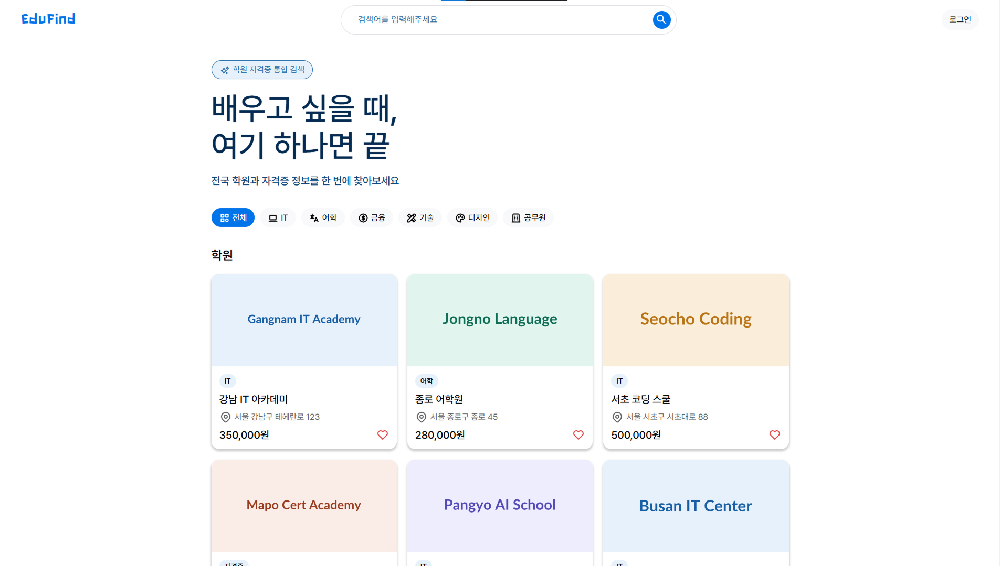

# 🎓 EduFind
학원 · 자격증 통합 검색 플랫폼  
전국 학원과 자격증 정보를 한 번에 찾고, 관심 있는 항목을 찜해서 관리할 수 있습니다.

## 🌐 배포
Vercel을 통해 배포되어 있습니다.

👉 **[https://edufind-th.vercel.app/](https://edufind-th.vercel.app/)**

## 📌 프로젝트 소개
EduFind는 학원과 자격증 정보를 통합 검색할 수 있는 플랫폼입니다.  
카테고리·지역·수강료 필터로 원하는 학원을 빠르게 찾고,  
로그인 후 하트 버튼으로 찜 목록을 관리할 수 있습니다.

### 주요 기능
- 🔍 학원 · 자격증 통합 검색
- 🗂 카테고리 / 지역 / 수강료 필터링
- 🏫 학원 상세 정보 (위치, 운영시간, 수강료, 연관 자격증)
- 📜 자격증 상세 정보 (난이도, 합격률, 시험 일정, 연관 학원)
- 🔐 회원가입 / 로그인 (bcrypt 암호화)
- ❤️ 찜 기능 (로그인 유저 전용, DB 저장)
- 📋 찜 목록 페이지 (학원 / 자격증 탭 분류)

## 🛠 기술 스택

### 💻 개발 환경

#### 1. Frontend
<table>
  <thead>
    <tr>
      <th>사용기술</th>
      <th>설명</th>
      <th>Badge</th>
    </tr>
  </thead>
  <tbody>
    <tr>
      <td>Next.js</td>
      <td>App Router 기반 풀스택 프레임워크</td>
      <td></td>
    </tr>
    <tr>
      <td>TypeScript</td>
      <td>정적 타입 언어</td>
      <td></td>
    </tr>
    <tr>
      <td>SCSS</td>
      <td>CSS Module 기반 스타일 관리</td>
      <td></td>
    </tr>
  </tbody>
</table>

#### 2. Backend/DB
<table>
  <thead>
    <tr>
      <th>사용기술</th>
      <th>설명</th>
      <th>Badge</th>
    </tr>
  </thead>
  <tbody>
    <tr>
      <td>MongoDB Atlas</td>
      <td>클라우드 데이터베이스</td>
      <td></td>
    </tr>
    <tr>
      <td>Mongoose</td>
      <td>MongoDB ODM</td>
      <td></td>
    </tr>
    <tr>
      <td>Axios</td>
      <td>HTTP 통신</td>
      <td></td>
    </tr>
  </tbody>
</table>

#### 3. 상태 관리
<table>
  <thead>
    <tr>
      <th>사용기술</th>
      <th>설명</th>
      <th>Badge</th>
    </tr>
  </thead>
  <tbody>
    <tr>
      <td>Zustand</td>
      <td>전역 상태 관리 (persist로 로그인 유지)</td>
      <td></td>
    </tr>
  </tbody>
</table>

#### 4. 환경
<table>
  <thead>
    <tr>
      <th>사용기술</th>
      <th>설명</th>
      <th>Badge</th>
    </tr>
  </thead>
  <tbody>
    <tr>
      <td>Visual Studio Code</td>
      <td>코드 편집기</td>
      <td></td>
    </tr>
    <tr>
      <td>GitHub/Git</td>
      <td>버전 관리</td>
      <td></td>
    </tr>
    <tr>
      <td>Figma</td>
      <td>디자인 & UI/UX</td>
      <td></td>
    </tr>
  </tbody>
</table>

#### 5. Deployment
<table>
  <thead>
    <tr>
      <th>사용기술</th>
      <th>설명</th>
      <th>Badge</th>
    </tr>
  </thead>
  <tbody>
    <tr>
      <td>Vercel</td>
      <td>배포</td>
      <td></td>
    </tr>
  </tbody>
</table>


## 📆 기간 및 인원
- 2026.05.14 ~ 2026.06.02
- 개인 프로젝트

## 📂 프로젝트 구조

```
📂src/
┣━━ 📂app/
┃   ┣━━ 📂(pages)/
┃   ┃   ┣━━ 📂academies/                # 학원 상세 페이지
┃   ┃   ┣━━ 📂certs/                    # 자격증 상세 페이지
┃   ┃   ┣━━ 📂login/                    # 로그인 페이지
┃   ┃   ┣━━ 📂search/                   # 검색 결과 페이지
┃   ┃   ┣━━ 📂signup/                   # 회원가입 페이지
┃   ┃   ┗━━ 📂wishlist/                 # 찜 목록 페이지
┃   ┣━━ 📂api/  
┃   ┃   ┣━━ 📂auth/
┃   ┃   ┃   ┣━━ 📂login/                # 로그인 API (이메일/비밀번호 검증 후 유저 반환)
┃   ┃   ┃   ┗━━ 📂register/             # 회원가입 API (유효성 검사 및 bcrypt 암호화 저장)
┃   ┃   ┣━━ 📂academies/                # 학원 목록/상세 조회 API
┃   ┃   ┣━━ 📂certs/                    # 자격증 목록/상세 조회 API
┃   ┃   ┗━━ 📂wishlist/                 # 찜 추가·삭제(토글) 및 목록 조회 API
┃   ┣━━ 📄layout.tsx                    # 전체 레이아웃 (Header, Footer, DataInitializer 포함)
┃   ┗━━ 📄page.tsx                      # 메인 페이지
┣━━ 📂components/   
┃   ┣━━ 📄DataInitializer.tsx           # 앱 최초 로드 시 학원·자격증 데이터를 store에 패치
┃   ┣━━ 📄Footer.tsx                    # 공통 푸터
┃   ┣━━ 📄Header.tsx                    # 공통 헤더 (검색, 로그인/로그아웃, 유저 메뉴)
┃   ┗━━ 📄WishButton.tsx                # 찜 하트 버튼 (로그인 여부 확인 후 토글)
┣━━ 📂lib/  
┃   ┗━━ 📄mongodb.ts                    # MongoDB 연결 및 연결 캐싱 관리
┣━━ 📂models/
┃   ┣━━ 📄Academy.ts                    # 학원 Mongoose 스키마
┃   ┣━━ 📄Cert.ts                       # 자격증 Mongoose 스키마
┃   ┣━━ 📄User.ts                       # 유저 Mongoose 스키마 (bcrypt 암호화 저장)
┃   ┗━━ 📄Wishlist.ts                   # 찜 목록 Mongoose 스키마
┣━━ 📂stores/
┃   ┣━━ 📄academyStore.ts               # 학원 데이터 전역 상태 (최초 1회 fetch 후 캐싱)
┃   ┣━━ 📄authStore.ts                  # 로그인 유저 정보 전역 상태 (localStorage 유지)
┃   ┣━━ 📄certStore.ts                  # 자격증 데이터 전역 상태 (최초 1회 fetch 후 캐싱)
┃   ┗━━ 📄wishlistStore.ts              # 찜 목록 전역 상태 (토글 및 목록 관리)
┣━━ 📂utils/
┃   ┗━━ 📄validate.ts                   # 회원가입 유효성 검사
┗━━ 📂types/
    ┣━━ 📄Main.ts                       # Academy, Cert 타입 정의
    ┣━━ 📄auth.ts                       # User, RegisterForm, FormErrors 타입 정의
    ┗━━ 📄Search.ts                     # 검색 드롭다운 관련 타입 정의
```
